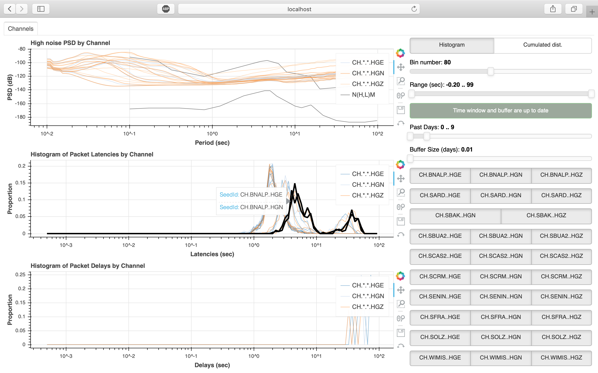

# Seismic-Network-Performance-Dashboard


## What
Dashboard for availability and quality assessment throughout data and products of seismic network.

## How
1. Install [slinktool](https://github.com/iris-edu/slinktool) and adapt script from [utils/slinktool.cron]().
2. Install [msnoise](http://www.msnoise.org) and adapt script from [utils/msnoise.cron]().
3. Schedule regular update of the previous with [crontab](https://pubs.opengroup.org/onlinepubs/9699919799/utilities/crontab.html) following [utils/cron]().
4. Install [Bokeh](http://www.bokeh.org) and run:
```bash
git clone https://github.com/FMassin/Seismic-Network-Performance-Dashboard.git
bokeh serve Seismic-Network-Performance-Dashboard/
```
